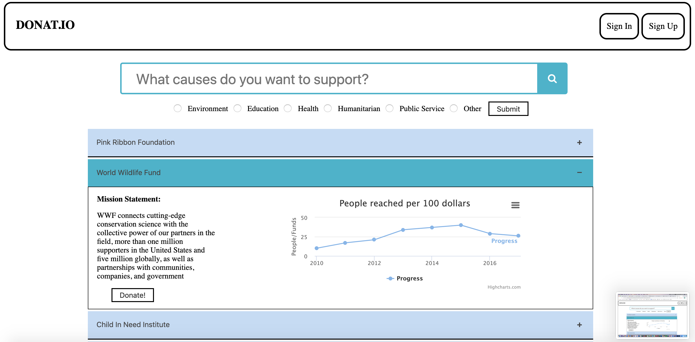

Erol Bulun, Jason Friedman, Romir Hysko, Aaron Kim, Archit Chopra

Professor Van Wart

TA: Cooper Barth

03/14/20

**Problem and Related Work (P1)**

There are a vast amount of NGOs that are generally unknown to the public. Furthermore, the public lacks the ability to compare and donate to these NGOs all on a singular platform. Our goal was to create a platform that allows users to browse NGO&#39;s (their mission statements, metrics, etc.) and adequately compare them to determine which one they will donate to. While we allow users to donate on our site, we also want our platform to help spread awareness about the work these NGOs do through the information that we provide.

Thus far, there are sites that serve a similar function to ours, however mostly for non profits organizations. Sites specific to NGOs typically are crowdfunding platforms that provide rewards to users for certain levels of donations. Our site does not utilize a crowdfunding model, and is exclusively for simple donations to both established and non-established NGOs. Despite this, our site endeavors to promote up and coming NGOs similarly to these crowdfunding sites. Additionally, our site will build on the metrics and general information on NGOs to provide users with a more comprehensive understanding of these institutions. We expect this to boost user trust in our website (and NGOs) should they decide to donate in the future.

**User Research (P2 and P3)**

Throughout the initial stages of our project, we believed user trust in our platform would be the most difficult obstacle we would face. During the research stage, we hoped to gauge the potential trust of users if our platform functioned as we described. Another issue was the general efficacy of our platform, and if it was an idea that the space wanted and would benefit from. Finally, we wanted to ascertain the interest of an average user who does not have a strong connection to NGOs. This would help us understand if our platform would appeal to a broader market, and not just users who already already have an interest in the subject.

        We utilized the interview research method. Each member of our group interviewed 2-4 people with 10 questions. The questions asked were centered around the aforementioned concerns, and it was a mixture of open response and yes/no questions. Before conducting the interviews, we first determined whether the interviewee was passionate about NGOs. We also gave them a brief summary of our platform&#39;s goal.

        Our results showed that trust was indeed a major issue for users, and that they would be skeptical especially in regards to donations. Users were also critical of the information we were providing on NGOs, and questioned its legitimacy. Our platform also exhibits a conflict of interest which concerns users. Realistically, our site will have to rely on donations to remain running. Due to this, users want to be ensured that we do not use shady practices to get people to donate and continue to use our site. It therefore became clear that our platform should build trust with our users, although we expect the solution to this to be mostly non-technical. In terms of pure usability, users expect the information on the site to be organized and easily accessible given the purpose of our platform. Additionally, we found that making the donation process both simple and helpful was an important balance to strike. Users of course want a simple method of payment, but they also want the ability to track where all their donations are going. We expect that our platform will mainly be used by people who are passionate about NGOs. Nevertheless, in keeping with our goal, we would like &quot;non-passionate&quot; users to also use our site to expose them to new possibilities, and to spread general awareness.

**Paper Prototyping (P4)**

At first, we found that our color scheme and general design was not appealing to users at all. Our color scheme was described as too striking, and the objects on our webpage were not efficiently placed. At the time, our website had buttons where the functionality was not clear since pressing them would generate no response (even on paper). This generally confused users. Additionally, our platform employed a checkbox search function that was located on the left side of the screen. We found that people prefer it to be on top of the screen in a header-like format. Users appreciated the general structure of our website, although as previously stated, it could have been better implemented. The collapsible nature of our NGOs was also a positive for users, as it allowed us to display a lot of information in a relatively smaller amount of space.

In order to mitigate these criticisms, we conducted rigorous testing on our color scheme, although this became difficult overtime because we changed the structure of our website multiple times. In terms of structure, our direction did not change drastically, and we focused on utilizing the space on the page efficiently with the objects we already had. Throughout this, we attempted to keep the checkboxes in a header format in keeping with user criticism. We abided by the Norman principles of design to give more intuitiveness to our site in terms of button interactions.

**High-Fidelity Prototyping (P5, P6, and P7)**

Task 1: Sign Up

A user signs up by clicking the Sign Up button in the top right of the home screen. The user is then redirected to the Sign Up page, where the user must enter his Name, E-Mail, Password, and whether the user would like to sign up to the mailing list. Then, after clicking submit, a new user profile is created and the user is automatically signed into his new account.

Step 1: Click Sign Up on Home Page

Step 2: Enter Name, E-Mail, Password, Confirm Password, and whether you want to be on mailing list. Click Submit

Step 3: You are redirected back to the home page, but you are now logged in. For our two hardcoded users (Name: Willie, Password: password1 and Name: Wildcat, password2) you can click Welcome, Name and view a unique viewing history for those users.

Task 2: Sign In

A user signs in by clicking the Sign In button in the top right of the home screen. The user is then redirected to the Sign In page, where the user must enter his name and password. After signing in, the user is redirected to his Viewing History page.

Step 1: Click Sign In in top right of home page

Step 2: Sign into either of the two hardcoded user profiles (Name: Willie, Password: password1 and Name: Wildcat, password2)

Step 3: Click Welcome, Willie (or Wildcat) to be redirected to their viewing history page.

Step 4: Browse through the viewing history for a specific user (Ex: Willie)

Task 3: User Discovers Nonprofits

A user scrolls through nonprofit organizations, clicking the ones he is interested in to view a description and metrics for that nonprofit&#39;s impact/performance.

Step 1: A user browses through nonprofits by scrolling down

Step 2: A user finds a nonprofit he is interested in and clicks it to get more info, including a description and graph of impact/performance.

Task 4: User searches for specific nonprofits/categories

A user types in the name of a nonprofit he cares about and clicks enter to filter nonprofits by keyword. Furthermore, a user selects a category and clicks submit to filter nonprofits by category.

Step 1: A user types in the name of a nonprofit and clicks enter to filter nonprofits by keyword

Step 2: Then a user selects a category and clicks submit to filter by category

Task 5: User scrolls through news related to nonprofits/issues he cares about

After filtering nonprofits by search or category, a user scrolls through the newsfeed at the bottom to read about the nonprofits and issues relevant to his search.

Task 6: User scrolls through his Viewing History page

Component 1: **Type:** Interactive Data Filter -\&gt; Basic Search Function with Category Checklist

Basic Search Function: This component enables a user to search for a nonprofit organization, by typing in a keyword and then pressing return/enter on their keyboard.

Category Checklist: This component enables a user to click a category/issue they care about, and then click &quot;Submit&quot; to filter the results by that category.

Component 2: **Type:** User Profiles -\&gt; Sign In and Viewing History Page

This component enables a user with an existing username and password to sign into their account by clicking Sign In in the top right of the home page. The user is then redirected to a Sign In page, where they sign in. Next, the user is redirected to the home page, where they are signed in with a Welcome, Name in the top right. If you sign into either of our hardcoded profiles (Name: Willie, Password: password1 and Name: Wildcat, password2), you can click Welcome, Name which will bring you to the Viewing History Page, where you can browse through the nonprofits that Willie and Wildcat care most about.

Component 3: **Type:** Data Collection Form -\&gt; Sign Up / Password Validation / Form Design

This component enables a user to click the Sign Up button in the top right of the home page, which brings the user to the Sign Up page. The Sign Up page asks for the user&#39;s Name, E-Mail, Password, and whether the user would like to sign up to the mailing list. We ask the user to confirm their password and the form validates that the passwords match, and validates that the passwords meet certain criteria, such as number of characters, and types of characters needed. The form also validates that the email meets certain criteria, for example that it includes an @ sign.

Component 4: **Type:** External Data Integration -\&gt; News based off search

This component enables a user who filters through nonprofits using our Basic Search Function to receive a customized news feed based off their current filter, which provides news which is more relevant to their search. The news API pulls the 5 top news headlines relevant to searched term.

Component 5: **Type:** Data Visualization -\&gt; Graph showing Impact/Performance of Nonprofit

This component enables a user who clicks a specific nonprofit to view a data visualization of that nonprofit&#39;s performance/impact over a period of time. That graph is clickable and can be interacted with.

**Reflection**

During our time, we accomplished 5 components. We instituted a Basic Search function with a Category Checklist which enables users to browse through the list of NGOs that we hardcoded. Our User Profiles component enables a user to sign in and view his unique viewing history (this feature is only available to our hard coded users Willie and Wildcat). We also implemented a data collection form which validates the user input to meet certain criteria (like password matching and email containing an @). We also enable the user to learn more information about a nonprofit by clicking on a nonprofit, which prompts a drop down description and graph. Our final component is our External Data Integration which uses a news API to pull the 5 top news headlines relevant to searched term.

In regards to design, we were able to improve our color scheme by adhering to the Web Accessibility guidelines. We also adhered to the principles of alignment and principles of consistency. We also adhered to Norman Design Principles including make relevant parts of the system visible. We used principles such as these to guide our design decisions.

We also used trial and error to improve our user experience by listening to user feedback in studio and iterating.

With more time, we would like to build on the metrics and information component extensively, as we believe that it would set us apart from other platforms in this space. This could be done by acquiring more information and metrics from the sites, and discovering an efficient method to display it to users. We would also like to make the news articles more relevant to the searched term, so that they are more useful for the user. Our design on our main webpage is strong as we spent most of our &quot;design time&quot; on that page. Nevertheless, we would spend more time on the design features of the sign in and viewing history pages. While they did inherit the design of our main web page, having different designs for them is a possibility we did not explore.

**Links**

Link to team&#39;s repository and working version: [https://github.com/RomirH/Donations](https://github.com/RomirH/Donations)

Instructions for running app:

-Use Chrome

-Control click index.html file in project\_8 and click open with chrome. Then, you can explore our app and follow the tasks described above.
